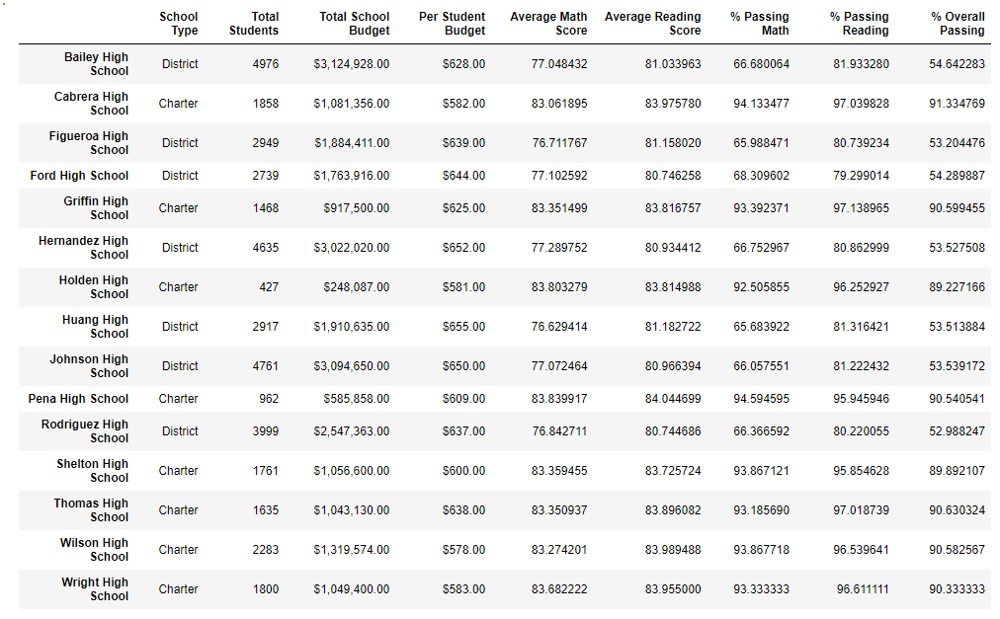
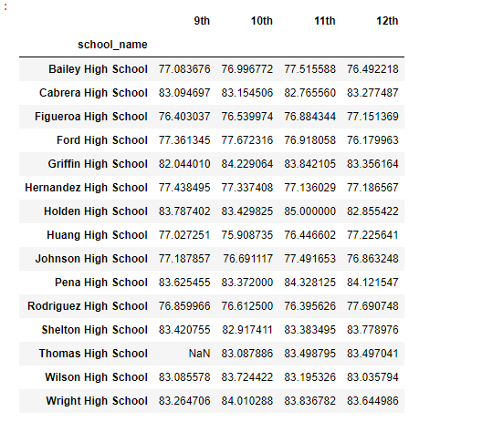
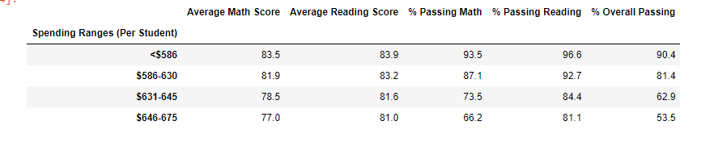
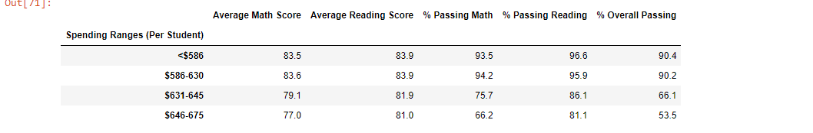
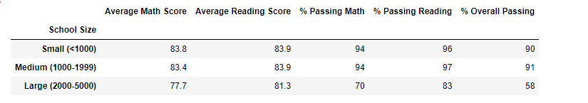
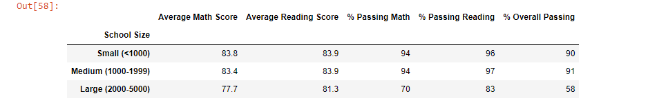
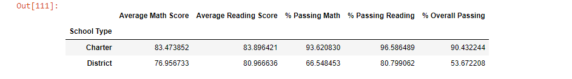
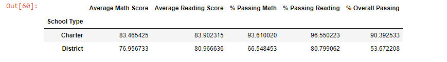

# School_District_Analysis.

## Overview
For this project we were asked to refractor previous code from our school district analysis.  It appears that there was a large majority of brazen ninth graders, who apparently cheated on not only math but reading tests.  While acedemic punishment is being decided, Maria has asked us to maintain the integrity of the analysis. Specifically, we want to exclude these scores from the analysis.  To preform the exclusion we used the .loc method on the previously completed data frame "school_data_complete_df".  Once that was completed, we used similar code and the .loc method to calculate new metrics for the remaining grades at thomas highschool.  With the final metrics calulated in the formate of the final deliverable, we used the .loc method to replace the previous scores.  In summary, we used .loc and new data frames to overwrite invalid data for our final deliverable to the school district. 

## Results

- **How is the district summary affected?**
    - The largest difference in the district summary is the total number of students changing from 39170 to 38709 which was caused by replacing ninth grade values with NaN. 
- **How is the school summary affected?**
    - Upon removing  the 9th graders, There was only a slight change in the overall, math, and overall percentage scores.  Images are below  This result tells me that 9th graders did not significantly overpreform the other grades when they cheated.  In the spirit of the budget analysis, the schoole board could make the decision that the determined "per student budget" should stay $638 for Thomas High.  the logic here is that the school preformed at a similar level.

- **How does replacing the ninth graders’ math and reading scores affect Thomas High School’s performance relative to the other schools?**
    - Looking at all metrics and schools, removing nith graders has not significantly changes Thomas High's performance
- **How does replacing the ninth-grade scores affect the following:**
    - Math and reading scores by grade
        - inboth dataframe average reading and mat scores were calculated off of null values returning a value of NaN in each data table.  See the below images for both math and reading changes

    - Scores by school spending
        - Thomas Highschool is in the $631 to $645.  We can see a slight grad inflation below:
            - Old DF

            - New DF

    - Scores by school size
        - There was a slight change in scores by school size, but is not visible when formated
            - Old DF

            - New Df

    - Scores by school type
        - We see a similar slight change in scores by school tpe.  see below: 
            - Old DF

            - new DF

## Summary
From this analysis, we learned that there were not material differences from the previous data set that included THS ninth graders.  With cheating the size of the sample of ninthgraders was not able to impact overall measurments.  This may be a factor of the total sample size >30,000.  Also, the student who participated in cheating may be less than previously thought, because the scores are very similar when only viewing 10th - 12th graders. 

